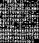

# Fontknife
[](https://opensource.org/licenses/BSD-3-Clause)
[](https://makeapullrequest.com)
[](https://github.com/pushfoo/Fontknife/actions/workflows/test.yaml?branch=main)
[](https://fontknife.readthedocs.io/en/main/?badge=main)
[](https://fontknife.readthedocs.io/en/stable/?badge=stable)


**Q**: How do I convert a font into a sprite sheet?<br/>
**A**: `fontknife convert`

| Goal                            |                                  End Result                                  | Command                                                                |
|---------------------------------|:----------------------------------------------------------------------------:|------------------------------------------------------------------------|
| Rasterize a font's ASCII glyphs |                         | `fontknife convert supported.font spritesheet.png`                     |
| Generate filler assets          |  | `fontknife convert -P 48 -G "💪😎" NotoEmoji-Regular.ttf arm_cool.png` |

For more detailed explanations, see [Practical Examples](#practical-examples).

## Install Instructions

### Users

If you only want to convert fonts, follow these steps:

1. Have [Python](https://python.org) 3.9+ installed
2. Make sure you've [created](https://docs.python.org/3/library/venv.html#creating-virtual-enviroments)
   and [activated](https://docs.python.org/3/library/venv.html#how-venvs-work)
   a virtual environemnt (or use [pipx](https://pypa.github.io/pipx/))
3. `pip install
4. Run `fontknife convert --help`

If the last command print help text, you're ready to go! Read it for a descirption of supported arguments.

### Developers / Contributors

See [CONTRIBUTING.md](https://github.com/pushfoo/fontknife/blob/master/CONTRIBUTING.md).

## Current Features

* Read multiple font formats (TTF, BDF, PCF, 1-bit sprite sheets)
* Read arbitrary unicode glyphs from supported fonts, including
  [multi-character emoji](https://unicode.org/emoji/charts/emoji-zwj-sequences.html)
* Export 1-bit sprite sheets to multiple image formats (PNG, BMP, JPG)
* Guess common formats from file extensions
* Simpler than GUI font editors
* Can be used as a library in custom Python scripts
* Assembly code generation (Partial support for [Octo](https://github.com/JohnEarnest/Octo))

Please remember:

1. This is alpha quality software, so there will be bugs and breaking changes
2. The [Future Features](#future-features) section lists known areas for improvements
3. The project accepts [pull requests](https://github.com/pushfoo/fontknife/pulls)


## Why did you make this?

1. It helps developers [iterate faster](https://www.youtube.com/watch?v=rDjrOaoHz9s).
2. A refactor of an abandoned projected turned into something else.

## Practical Examples

### 1. Export Specific Glyphs / Make Game Assets

**Scenario**: You need filler assets for a farming game, ASAP.<br/>
**Solution**:

1. Download an appropriately licensed emoji font, such as
[Noto Emoji](https://fonts.google.com/noto/specimen/Noto+Emoji),
2. Run the following command
    ```commandline
    fontknife convert -P 48 -G "🌽🍇🍎🍏🫐🍓🍒🍐🍅🥕🥔🥒🍑🥑🧅🍈" NotoEmoji-Regular.ttf fruits_and_veggies.png
    ```
3. Double check & color the results with your preferred image editor

   

### 3. Generate Octo Assembly

_Note: This feature is mostly broken legacy code inherited from
an earlier project._

You can generate a width table and sprite data table as valid
[Octo](https://github.com/JohnEarnest/Octo) source if your font meets
the following requirements:

1. All glyphs can render as 8px x 8px or smaller
2. There are 256 or fewer glyphs in the font

For example, run the following to generate tables of widths and sprite data
for [Tom Thumb](https://robey.lag.net/2010/01/23/tiny-monospace-font.html)
as Octo source:

```commandline
fontknife emit-code tom-thumb.bdf tom-thumb.8o
```

The data tables should be usable, but the attached drawing routines are not:

1. Their underlying logic is broken
2. They predate Octo's idiomatic [`:stringmode` macro](http://johnearnest.github.io/Octo/docs/Manual.html#strings)


## Future features

Features in this section will be added if:

1. A PR is made addressing it
2. I have time / interest

The features below are in descending order, from highest to lowest priority:

| Feature                                                        | Questions / Blockers                 | Easiest known approach                                                        |
|----------------------------------------------------------------|--------------------------------------|-------------------------------------------------------------------------------|
| Better documentation                                           |                                      | Sphinx + RTD, in progress                                                     |
| Fix automatic sheet sizing                                     |                                      |                                                                               |
| Export with transparent background color                       | Outline detection                    | Improve cli color parsing, replace `#000` default with `#0000`                |
| Add foreground color control                                   |                                      | Same as above                                                                 |
| Export to folder of files per glyph                            | File naming                          | Use the unicode [code point](https://en.wikipedia.org/wiki/Code_point)        |
| Support for automatically reading TTF glyph tables             |                                      | Use [fonttools](https://github.com/fonttools/fonttools) to read the TTF table |
| Fix ugly caching behavior                                      |                                      | Delete / disable caching entirely                                             |
| Better scaling flags, including downsampling                   |                                      | Recommend imagemagick or image editors                                        |
| Additional font formats (see [Future Formats](#future-formats) |                                      | Time / interest                                                               |
| C header code generation                                       |                                      | Time / interest                                                               |
| Refactor or remove Octo generation                             |                                      | Move it to a downstream project                                               |
| Better interface for glyph subset selection                    | Good design unclear                  | Write doc on using fontknife in scripts                                       |
| Color TTF support                                              | Pillow has bad support for color TTF | Unknown, help welcome!                                                        |

### Future Formats

Potential font formats to support:

* [FNT](https://web.archive.org/web/20110513200924/http://support.microsoft.com/kb/65123) and other old Windows formats
* [UXF](https://wiki.xxiivv.com/site/ufx_format.html)
