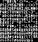

|project_name|
##############

.. raw:: html

   

.. rubric:: Remember that weird font?

.. _home_sprite_sheet:

Make it a sprite sheet!

``fontknife convert tom-thumb.bdf sheet.png``

   *(Shown at 200% size)*

.. _home_filler_assets:

Make Filler Assets!

``fontknife convert -P 48 -G "💪😎" NotoEmoji-Regular.ttf sheet.png``

.. figure:: ./flex_cool.png
   :alt: The cool sunglasses and flexed bicep emoji as a png

.. toctree::
   :maxdepth: 2
   :caption: Getting Started

   install/requirements
   install/user
   install/library
   install/contributor

.. toctree::
   :maxdepth: 3
   :caption: Usage Guide

   usage/command_line
   filler_assets/index
   font_kinds/index

.. toctree::
   :maxdepth: 3
   :caption: Theory

   text_rendering_is_really_hard
   glossary

.. this is a comment, and it wraps everything below
   * :ref:`genindexFor `
   * :ref:`modindex`
   * :ref:`search`
